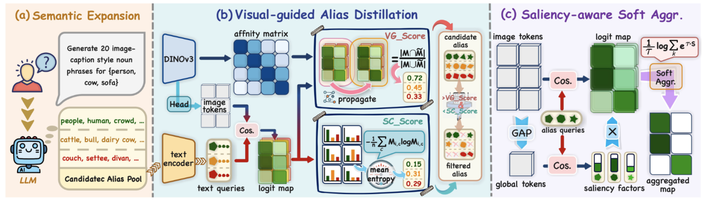

# [ICML 2026 ✨] *VIP*: Visual-guided Prompt Evolution for Efficient Dense Vision-Language Inference 

This repository contains the source code of [*VIP*: Visual-guided Prompt Evolution for Efficient Dense Vision-Language Inference.]()

<br>

</div>


> - Production from [Institute of Computing Technology, Chinese Academy of Sciences](http://www.ict.ac.cn/).
> - Primary contact: **Hao Zhu** (zhuhao22z@ict.ac.cn).


## Abstract

> *Pursuing training-free open-vocabulary semantic segmentation in an efficient and generalizable manner remains challenging due to the deep-seated spatial bias in CLIP. To overcome the limitations of existing solutions, this work moves beyond the CLIP-based paradigm and harnesses the recent spatially-aware dino.txt framework to facilitate more efficient and high-quality dense prediction.
> While dino.txt exhibits robust spatial awareness, we find that the semantic ambiguity of text queries gives rise to severe mismatch within its dense cross-modal interactions. To address this, we introduce Visual-guided Prompt evolution (VIP) to rectify the semantic expressiveness of text queries in dino.txt, unleashing its potential for fine-grained object perception. Towards this end, VIP integrates alias expansion with a visual-guided distillation mechanism to mine valuable semantic cues, which are robustly aggregated in a saliency-aware manner to yield a high-fidelity prediction. Extensive evaluations demonstrate that VIP: 1. surpasses the top-leading methods by 1.4%-8.4% average mIoU, 2. generalizes well to diverse challenging domains, and 3. requires marginal inference time and memory overhead.*


## Get Started

### Environment

This repo is built on top of [dinov3](https://github.com/facebookresearch/dinov3) (zero-shot tasks with `dino.txt`) and [MMSegmentation](https://github.com/open-mmlab/mmsegmentation). To run VIP, please install the following packages with your Pytorch environment. We recommend using Pytorch==2.0.x for better compatibility to the following MMSeg version and dinov3.

- Ubuntu 20.04, with Python 3.9.10, PyTorch 2.0.0, CUDA 11.6, multi gpus(8) - Nvidia RTX 3090.
- You can install all dependencies with the provided requirements file.

```bash
pip install -r requirements.txt
```

### Data Preparations

We include the following dataset configurations in this repo:

<details>
<summary>
Datasets of natural images and urban scene
</summary>

For this scenario, we incorporate eight datasets, including Pascal VOC, Pascal Context, Cityscapes, ADE20K, and COCO-Stuff164k. Please follow the [MMSeg data preparation document](https://github.com/open-mmlab/mmsegmentation/blob/main/docs/en/user_guides/2_dataset_prepare.md) to download and pre-process the datasets. The COCO-Object dataset can be converted from COCO-Stuff164k by executing the following command:

```
python datasets/cvt_coco_object.py PATH_TO_COCO_STUFF164K -o PATH_TO_COCO164K
```

**Remember to modify the dataset paths in the config files in** `config/cfg_DATASET.py`

</details>

<details>
<summary>
Datasets on remote sensing images
</summary>

For the remote sensing domain, we evaluate our approach on four datasets: iSAID, Vaihingen, Potsdam, and VDD. Please follow the [SegEarth-OV data preparation document](https://github.com/likyoo/SegEarth-OV/blob/main/dataset_prepare.md) to download and pre-process these datasets.

</details>

## Usage

Single-GPU running:

```
python eval.py --config ./configs/cfg_DATASET.py --workdir YOUR_WORK_DIR
```


Multi-GPU running:

```
bash ./dist_test.sh ./configs/cfg_DATASET.py
```


## Citation

Please cite our work if you find it helpful to your research.

```bibtex
@misc{zhuVIP,
      title={VIP: Visual-guided Prompt Evolution for Efficient Dense Vision-Language Inference}, 
      author={Hao Zhu and Shuo Jin and Wenbin Liao and Jiayu Xiao and Yan Zhu and Siyue Yu and Feng Dai},
      year={2026},
      eprint={2605.12325},
      archivePrefix={arXiv},
      primaryClass={cs.CV},
      url={https://arxiv.org/abs/2605.12325}, 
}
```


## Acknowledgement

This repo is built upon [SCLIP](https://github.com/wangf3014/SCLIP), [SegEarth-OV](https://github.com/likyoo/SegEarth-OV/tree/main) and [dinov3](https://github.com/facebookresearch/dinov3), thanks for their excellent works!

